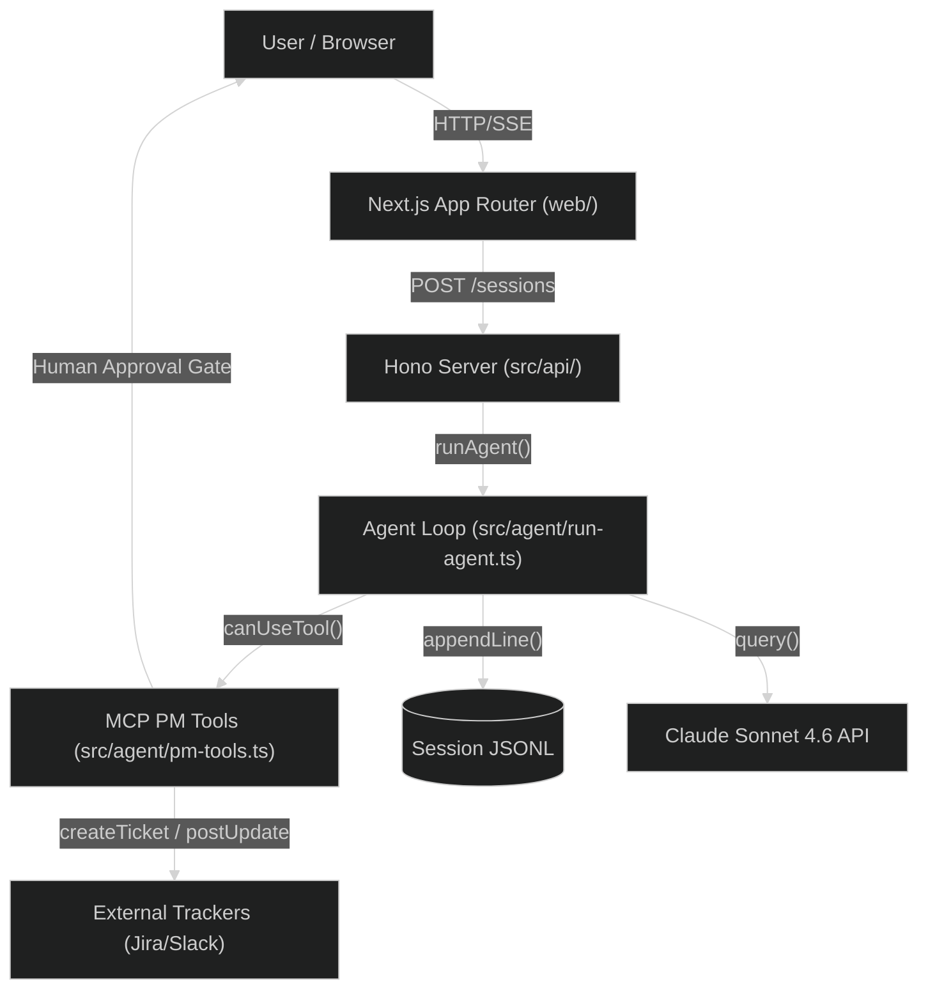
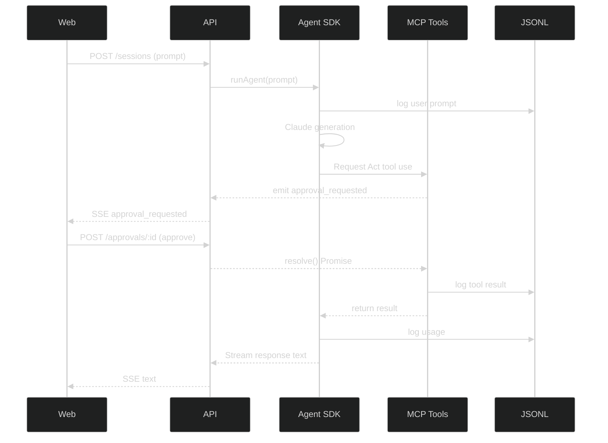

# Meridian

An agent SaaS for product managers, built on the Claude Agent SDK (`@anthropic-ai/claude-agent-sdk`). It features a minimal core (Read / Write / Search / Act), skill-based extension, transparent JSONL session logging, and human approval on every external write.

## Key Features

- **Agent Core**: Uses `@anthropic-ai/claude-agent-sdk` for a robust `query()` loop.
- **Skill-based Extension**: Markdown-based skills (`/skills`) loaded dynamically.
- **Transparent Logging**: Sessions stored as JSONL for full auditability.
- **Human-in-the-Loop**: External writes require explicit human approval via the UI.
- **Japandi UI**: Soft-neumorphic design system Vendored under `/design-system` for the frontend.

## Tech Stack

- **Language**: TypeScript
- **Runtime**: Node 20+ (ESM, `tsx` for dev)
- **Agent**: `@anthropic-ai/claude-agent-sdk`
- **Model**: Claude Sonnet 4.6 (default)
- **API**: Hono (SSE streaming)
- **Frontend**: Next.js 15 / React 19 (App Router)
- **Styling**: Japandi design system / CSS Tokens

## Prerequisites

- Node.js 20 or higher
- npm or pnpm
- Anthropic API Key (`ANTHROPIC_API_KEY`)

## Getting Started

### 1. Clone the Repository

```bash
git clone <repository-url>
cd Meridian
```

### 2. Install Dependencies

Install root dependencies (API):

```bash
npm install
```

Install frontend dependencies:

```bash
npm --prefix web install
```

### 3. Environment Setup

Copy the example environment file:

```bash
cp .env.example .env
```

Configure the following variables in `.env`:

| Variable             | Description                   | Example             |
| -------------------- | ----------------------------- | ------------------- |
| `ANTHROPIC_API_KEY`  | Required for Claude Agent SDK | `sk-ant-api03-...`  |
| `PM_AGENT_MODEL`     | Default model used            | `claude-sonnet-4-6` |
| `PM_AGENT_MAX_TURNS` | Max agent loop turns          | `30`                |
| `PORT`               | API server port               | `8787`              |

### 4. Start Development Servers

You will need to run both the API server and the Next.js frontend.

```bash
# Terminal 1: API Server
npm run dev

# Terminal 2: Web App
npm --prefix web run dev
```

The API will be available at `http://localhost:8787` and the web app at `http://localhost:3000`.

Open [http://localhost:3000](http://localhost:3000) in your browser.

## Architecture

### Directory Structure

```
├── src/                  # API and Agent core
│   ├── agent/            # Agent loop and tool primitives
│   ├── api/              # Hono server implementation
│   └── extensions/       # External connector stubs (Jira/Slack)
├── web/                  # Next.js 15 App Router frontend
│   ├── app/              # Next.js pages and globals
│   ├── components/       # UI Components
│   └── lib/              # API clients
├── sessions/             # JSONL session log storage
├── skills/               # Markdown-based agent skills
├── workspaces/           # Workspace-specific context
├── design-system/        # Japandi design reference bundle
└── evals/                # Evaluation scripts
```

### Request Lifecycle

1. User submits prompt via Next.js Web App.
2. Request hits Hono API `/sessions`.
3. Agent SDK `query()` loop starts in `src/agent/run-agent.ts`.
4. Agent uses tools (Read, Write, Search, Act). External actions emit `approval_requested` over SSE.
5. User approves action in the UI, POSTing to `/approvals/:id`.
6. Agent continues and final response streams back via SSE.
7. Session state and tool usage persisted to JSONL in `/sessions`.

### Key Components

**Agent Loop (`src/agent/run-agent.ts`)**
Single agent utilizing `@anthropic-ai/claude-agent-sdk`. System prompt dynamically includes workspace context and matched skill fragments.

**Tools & Approval Gate**
Tools are divided into primitives (Read, Write, Search, Act). The `Write` and `Act` tools are strictly gated by human approval in `canUseTool`, blocking execution until approved via API.

**Session Storage (`/sessions/*.jsonl`)**
Log lines contain `user`, `assistant`, `tool_call`, `tool_result`, or `meta`. Ensures perfect transparency without polluting model context.

## Wiki & Onboarding Guides

<details>
<summary><strong>Principal-Level Onboarding Guide</strong></summary>

### 1. System Philosophy & Design Principles

The PM Agent is an agentic SaaS designed to help Product Managers transform raw inputs into structured artifacts. Its design relies on a few core invariants:

- **Hermetic Transparency:** Every session is fully auditable. The context window is kept minimal (`<1000` tokens core prompt), and every event is written as a JSONL line _before_ streaming to the client (`src/agent/run-agent.ts:73`).
- **Human-in-the-Loop (HITL) Safety:** External writes or destructive actions are modeled as MCP tools but strictly blocked on human approval. The agent loop pauses via an API-gated Promise before taking action (`src/agent/run-agent.ts:102`).
- **Separation of State:** Chat state is never implicitly stored in memory. The source of truth is the JSONL append-only log in the `/sessions` directory.

### 2. Architecture Overview



_(Citations: `README.md:107`, `src/agent/run-agent.ts:111`, `src/api/server.ts:45`)_

### 3. Key Abstractions & Interfaces

- **`SessionLine` & `MetaLine`:** Every event is typed. Conversation lines (`user`, `assistant`, `tool_call`) flow back to the model, while `meta` lines (e.g., token usage, branch pointers) serve purely as UI state markers (`src/agent/session-store.ts:9`).
- **`PendingApproval`:** An interface connecting the suspended agent loop with the web client. The agent loop waits on the `resolve` function of the Promise stored in the in-memory `pendingApprovals` map (`src/agent/run-agent.ts:35`).

### 4. Decision Log

- **Why JSONL over a Database?** To maximize transparency and simplicity without schema migrations. The agent loop reads from JSONL logs, acting as an event-sourcing model for agent state.
- **Why a Custom MCP Server?** By wrapping the PM tools in an MCP Server (`src/agent/pm-tools.ts:75`), we can seamlessly integrate them into the Anthropic SDK while maintaining control over the HITL gate.

### 5. Dependency Rationale

- **`@anthropic-ai/claude-agent-sdk`**: Handles the recursive `query()` tool-use loop and handles context limits.
- **`Hono`**: Extremely lightweight, fast router that excels at streaming Server-Sent Events (SSE) out of the box (`src/api/server.ts:7`).
- **`Next.js 15` / `React 19`**: Frontend framework providing App Router and Server Actions.

### 6. Data Flow & State



_(Data Flow traced from: `src/api/server.ts:45-73`, `src/agent/run-agent.ts:102`)_

### 7. Failure Modes & Error Handling

- **Blocked Approvals:** If a user never approves an action, the agent's tool execution promise hangs in-memory. Because the application runs in Node (not a serverless edge function), it won't abruptly timeout, but restart of the API server will orphan the pending approval (`src/agent/run-agent.ts:102`).
- **Concurrent Writes:** JSONL lines are appended async. At high concurrency, `appendFile` might suffer interleaving, but realistically it's single-user per session.

### 8. Performance Characteristics

- **Bottlenecks:** Re-reading the entire JSONL file on every page load or resume (`src/agent/session-store.ts:26`) could become slow for very long sessions.
- **Token Efficiency:** The core system prompt is `<1000` tokens, keeping the base context cheap (`src/agent/run-agent.ts:25`). Usage is strictly logged via `MetaLine` data.

### 9. Security Model

- **Trust Boundaries:** The agent runs on the server. The user controls the frontend. The `pendingApprovals` map ensures no client can fake an MCP tool return without a valid `approvalId`.
- **Read/Write Limits:** Built-in SDK tools (`Glob`, `Grep`, `Read`) are allowed without approval, assuming read-only safety, while all actions (`act_*`) are gated (`src/agent/run-agent.ts:96`).

### 10. Testing Strategy

Evaluations are used to ensure agent capability and safety, rather than traditional granular unit tests.

- Run `npm run evals` to trigger the evaluation harness (`README.md:143`).

### 11. Operational Concerns

- **Sessions Directory:** The API process needs read/write permissions for `/sessions` and `/workspaces`.
- **Stateless Deployments:** Since `pendingApprovals` is an in-memory `Map` (`src/agent/run-agent.ts:35`), horizontal scaling of the API requires sticky sessions or a migration to a distributed state store (e.g. Redis) for the approvals map.

### 12. Known Technical Debt

- **In-Memory Approvals:** `export const pendingApprovals = new Map()` limits the API server to a single node (`src/agent/run-agent.ts:35`).
- **No Auth Yet:** v1 lacks authentication; Clerk middleware is slated for future implementation (`src/api/server.ts:5`).

</details>

<details>
<summary><strong>Zero-to-Hero Contributor Guide</strong></summary>

### 1. What This Project Does

The PM Agent is an agentic SaaS built specifically for Product Managers. It helps transform raw product inputs (like transcripts, user metrics, and docs) into polished PRDs, tickets, and release notes, incorporating human-in-the-loop safety before executing external actions.

### 2. Prerequisites

- Node.js v20+
- `npm` or `pnpm`
- Anthropic API Key (Claude)

### 3. Environment Setup

1. **Clone & Install**

   ```bash
   git clone <repo_url> Meridian
   cd Meridian
   npm install
   npm --prefix web install
   ```

2. **Environment Configuration**

   ```bash
   cp .env.example .env
   ```

   Add `ANTHROPIC_API_KEY=sk-ant-api03-...` to your `.env` file.

3. **Start the Servers**

   ```bash
   # Terminal 1: Starts the API server (Hono) on :8787
   npm run dev

   # Terminal 2: Starts the Next.js Web server on :3000
   npm --prefix web run dev
   ```

   Expected output in Terminal 1: `pm-agent api on :8787` (`src/api/server.ts:99`).

### 4. Project Structure

```text
├── src/agent/        # Core agent loop and MCP tools (e.g. run-agent.ts)
├── src/api/          # Hono backend API, SSE endpoints (server.ts)
├── src/extensions/   # External API integrations (Slack, Jira)
├── web/              # Next.js frontend application
├── sessions/         # JSONL storage for conversation logs
├── skills/           # Markdown-based skills to enhance agent abilities
├── workspaces/       # Project-specific contextual knowledge (CONTEXT.md)
└── design-system/    # Shared CSS tokens and Japandi UI components
```

_(Citation: `README.md:89-103`)_

### 5. Your First Task: Adding a New Skill

1. Create a new file in `skills/new-skill.md`.
2. Add a system prompt fragment mapping out what the skill does.
3. The `detectSkill` function will automatically pick it up and inject it into the `runAgent()` context loop based on user prompts.

### 6. Development Workflow


### 7. Running Tests

We rely heavily on LLM evaluation harnesses for agent testing:

```bash
npm run evals
```

_(Citation: `README.md:143`)_

### 8. Debugging Guide

- **Port In Use (8787 or 3000):** If `npm run dev` fails with `EADDRINUSE`, kill the existing node process or run Next.js on another port: `npm --prefix web run dev -- -p 3001` (`README.md:180`).
- **Agent Doesn't Respond:** Double check your `.env` for `ANTHROPIC_API_KEY`. If the session hangs after a tool call, verify if there is an unapproved action in the frontend UI.

### 9. Key Concepts

- **Human-in-the-Loop (HITL):** Before writing to an external tool (like Jira), the agent's SDK pauses. We hold the promise open in a `pendingApprovals` Map until the user explicitly approves (`src/agent/run-agent.ts:111`).
- **JSONL Session Store:** We don't use PostgreSQL. Every session is an append-only `.jsonl` file in the `/sessions` folder (`src/agent/session-store.ts`).

### 10. Code Patterns

**Adding a New Tool:**
Add tools in `src/agent/pm-tools.ts`. To ensure it requires human approval, prefix the tool name with `mcp__pm-tools__act_`. The `canUseTool` middleware in `run-agent.ts` automatically blocks tools matching this prefix.

```typescript
const myNewActTool = tool(
  "act_do_something",
  "Description of tool...",
  { param: z.string() },
  async (input) => { ... }
);
```

### 11. Common Pitfalls

- **Adding logic without `await`ing appending to the log:** `appendLine` must complete _before_ streaming text back to the client (`src/agent/run-agent.ts:73`).
- **Modifying Core Prompt instead of using Skills:** Keep `CORE_SYSTEM_PROMPT` tiny. Put feature-specific knowledge in `/skills` and project-specific knowledge in `/workspaces/*/CONTEXT.md` (`src/agent/run-agent.ts:24`).

### 12. Where to Get Help

Check out the `README.md` or jump into the issues page on the repository. The backend uses the official `@anthropic-ai/claude-agent-sdk`, so the Anthropic SDK docs are your friend.

### 13. Glossary

- **MCP (Model Context Protocol):** A standard to expose tools to the agent.
- **SSE (Server-Sent Events):** The streaming protocol we use over HTTP to stream the Claude output to the UI in real-time (`src/api/server.ts:45`).
- **Japandi UI:** Our bespoke soft-neumorphic design system located in `/design-system`.

### 14. Quick Reference Card

- **Start Backend:** `npm run dev`
- **Start Frontend:** `npm --prefix web run dev`
- **Typecheck:** `npm run typecheck` & `npm --prefix web run typecheck`
- **Run Evals:** `npm run evals`

</details>

## Available Scripts

| Command                          | Description                                    |
| -------------------------------- | ---------------------------------------------- |
| `npm run dev`                    | Start API server with watch (`tsx`)            |
| `npm run start`                  | Start API server                               |
| `npm run typecheck`              | Run TypeScript compiler without emitting files |
| `npm run evals`                  | Run evaluation harness                         |
| `npm --prefix web run dev`       | Start Next.js frontend dev server              |
| `npm --prefix web run typecheck` | Typecheck frontend                             |

## Testing

Evaluations are used to ensure agent capability and safety.

```bash
# Run evaluations
npm run evals
```

## Deployment

Since there are no specialized deployment configs present (e.g. `Dockerfile`, `vercel.json`), here is general guidance.

### API Deployment (Node.js)

1. Set up a Node.js environment (e.g. Render, Railway, AWS ECS).
2. Install dependencies: `npm install --omit=dev`.
3. Start the server: `npm run start`.
4. Ensure `ANTHROPIC_API_KEY` and other environment variables are set securely.
5. You will need persistent volume storage mounted at `/sessions` and `/workspaces` if persisting file logs.

### Web Deployment (Vercel/Next.js)

The `/web` directory can be deployed directly to Vercel or Netlify.

1. Connect your repository to Vercel.
2. Set the Root Directory to `web/`.
3. Provide any required environment variables (e.g., `NEXT_PUBLIC_API_BASE`).

## Troubleshooting

### API Port Conflicts

**Error:** `EADDRINUSE: address already in use :::8787`

**Solution:** Change the port in your `.env` file or stop the conflicting process.

### Frontend Port Conflicts

**Error:** Port 3000 is in use.

**Solution:** Next.js will ask to use another port, or you can force it:

```bash
npm --prefix web run dev -- -p 3001
```

### Missing API Key

**Error:** Agent fails to start or respond.

**Solution:** Ensure `ANTHROPIC_API_KEY` is properly set in your root `.env` file.
