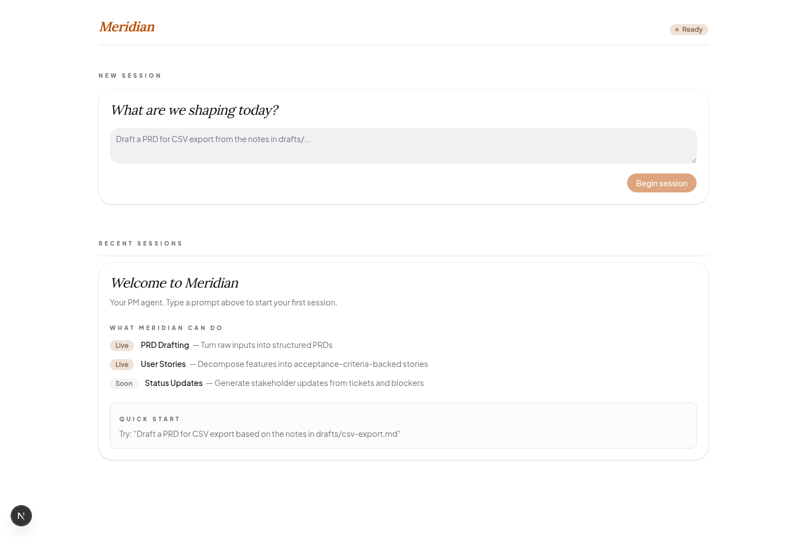
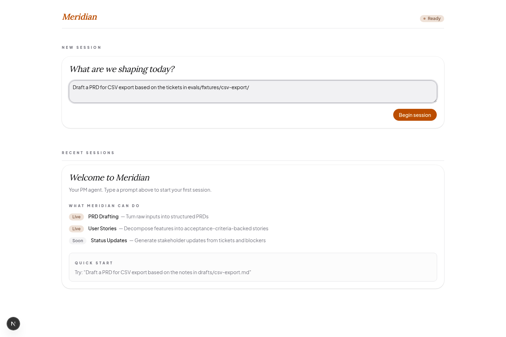
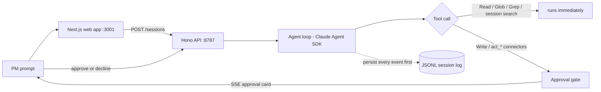

# Meridian

A PM agent that turns raw inputs (tickets, transcripts, docs, Slack threads)
into decision-ready artifacts. PRDs and user stories today. Every draft cites
its sources, and no external write happens without your approval.



PM work starts scattered: support tickets, meeting transcripts, half-formed
notes. Meridian does the conversion to structured documents and shows its
work. Every requirement traces back to an input it actually read, conflicts
and missing evidence get flagged before drafting, and anything that would
leave your machine (a ticket, a Slack post) waits for an explicit approve.

## Quickstart

```bash
git clone https://github.com/Samiu1/Meridian.git && cd Meridian

# Install everything
npm install && npm --prefix web install

# Interactive setup - creates .env and your first workspace
npm run setup

# Start both servers (API :8787 + web :3001)
npm run dev
```

Open [http://localhost:3001](http://localhost:3001) and type your first prompt.

**You need:** Node.js 20+ and an Anthropic API key (`ANTHROPIC_API_KEY`).



## What Meridian can do

| Skill | Status | What it does |
|-------|--------|--------------|
| PRD Drafting | Live, eval-covered | Turns tickets, transcripts, Slack threads, and notes into structured PRDs with citations |
| User Story Decomposer | Live, eval-covered | Breaks feature briefs and PRDs into stories with acceptance criteria, priority, and source traces |
| Status Updates | Planned (Phase 2) | Generates stakeholder updates from tickets and blockers |
| Release Notes | Planned (Phase 2) | Changelog to user-facing release notes |

Repo policy: no skill ships without eval cases. See
[docs/EVALUATIONS.md](docs/EVALUATIONS.md).

## How it works

1. You type a prompt in the web UI.
2. The agent assembles a system prompt: a small core, your workspace
   `CONTEXT.md`, and at most one skill fragment matched to your intent.
3. It reads your inputs first, surfaces gaps and conflicts, then drafts.
4. Read/search tools run freely. Writes and external actions (tickets, Slack
   posts) pause on an approval card in the UI until you approve or decline.
5. Every event is persisted to a JSONL session log before it streams to the
   UI, so each run is fully auditable and resumable.


```mermaid
flowchart LR
    U[PM prompt] --> W[Next.js web app :3001]
    W -->|POST /sessions| A[Hono API :8787]
    A --> R[Agent loop - Claude Agent SDK]
    R --> T{Tool call}
    T -->|Read / Glob / Grep / session search| X[runs immediately]
    T -->|Write / act_* connectors| G[Approval gate]
    G -->|SSE approval card| U
    U -->|approve or decline| A
    R -.persist every event first.-> L[(JSONL session log)]
```

Full details in [docs/ARCHITECTURE.md](docs/ARCHITECTURE.md).

## Quality: evals before features

The eval harness (`npm run evals`) runs the real agent loop against fixture
inputs and asserts the behaviors a PM actually depends on:

- reads every input file it was pointed at
- cites the ticket, thread, or transcript each requirement came from
- never fabricates a citation
- flags conflicting inputs, missing metrics, missing evidence, and oversized
  scope before drafting
- blocks every external write that was not approved

Current suite: **15 cases, 57 structural checks** across the two live skills.
Suite inventory, how to run it, and what comes next (an LLM judge layer) are
in [docs/EVALUATIONS.md](docs/EVALUATIONS.md).

## Product decisions and their tradeoffs

The short version; each decision has context and a revisit trigger in
[docs/DECISIONS.md](docs/DECISIONS.md):

| Decision | Tradeoff accepted |
|----------|-------------------|
| Local-first, single user | No auth, no multi-tenant isolation yet |
| JSONL files as the session store | No SQL queries; full-text scan for search |
| Human approval gate on all external writes | Slower loops by design |
| Structural eval checks before an LLM judge | Judgment quality is not yet auto-scored |
| One wedge skill validated before breadth | Fewer features, deeper each |
| Connectors behind a stub boundary | Linear/Slack return placeholders until Phase 4 |

## Deliberately not built yet

Auth (Clerk slot exists, not wired), hosted/multi-tenant deployment, real
Linear/Slack connectors, BYO-LLM provider abstraction, mobile, multiplayer.
The reasoning and sequencing live in [ROADMAP.md](ROADMAP.md), including the
"What NOT to build yet" list.

## Docs

- [ROADMAP.md](ROADMAP.md) - phased plan from clone-and-run to 10 local users
- [docs/ARCHITECTURE.md](docs/ARCHITECTURE.md) - request lifecycle, agent loop, session format
- [docs/EVALUATIONS.md](docs/EVALUATIONS.md) - eval philosophy, suite inventory, verification status
- [docs/DECISIONS.md](docs/DECISIONS.md) - decision log with tradeoffs and revisit triggers
- [CONTRIBUTING.md](CONTRIBUTING.md) - dev setup and repo conventions

## Commands

| Command | Description |
|---------|-------------|
| `npm run dev` | Start API (:8787) + web (:3001) together |
| `npm run dev:api` | Start API server only |
| `npm run setup` | Interactive setup wizard |
| `npm run typecheck` | TypeScript check (root) |
| `npm run evals` | Run the evaluation harness |
| `npm run evals -- --dry-run` | Resolve all cases and checks without model calls |
| `npm --prefix web run dev` | Start web app only |
| `npm --prefix web run typecheck` | TypeScript check (web) |

## Environment variables

| Variable | Required | Default | Notes |
|----------|----------|---------|-------|
| `ANTHROPIC_API_KEY` | Yes | - | Claude API key |
| `PM_AGENT_MODEL` | No | `claude-sonnet-4-6` | Model for agent runs |
| `PM_AGENT_MAX_TURNS` | No | `30` | Max agent loop turns |
| `PORT` | No | `8787` | API server port |

## Troubleshooting

**Port conflict:** change `PORT` in `.env` (API) or edit `web/package.json`
dev script port (web).

**Agent not responding:** check `ANTHROPIC_API_KEY` in `.env`. If a session
hangs, look for an unapproved action in the UI.

**Stale sessions:** sessions are JSONL files in `/sessions`. Delete any to
clear history.
