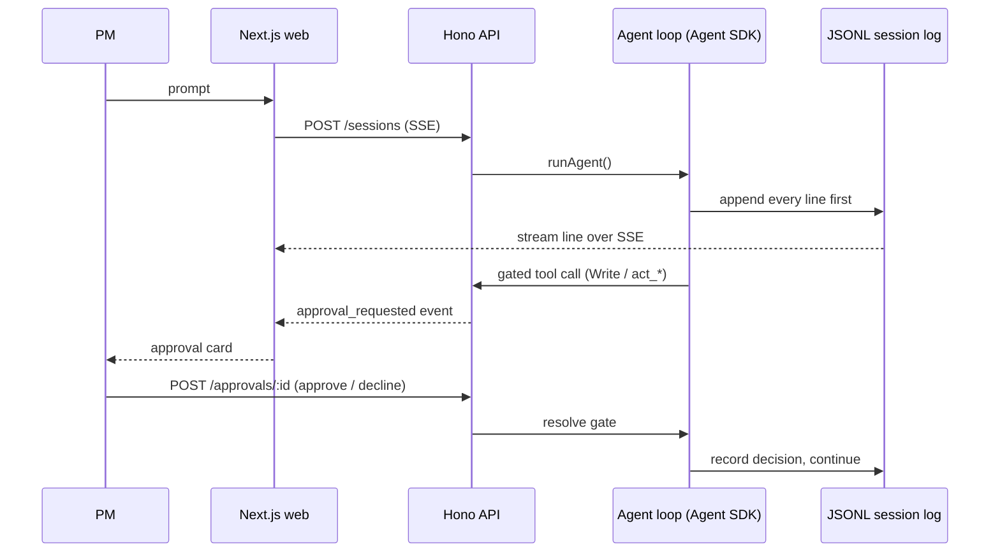

# Architecture

Contributor-facing deep dive. For the product overview see the README.

## Request lifecycle

1. The PM submits a prompt in the Next.js web app.
2. `POST /sessions` hits the Hono API (`src/api/server.ts`).
3. `runAgent()` (`src/agent/run-agent.ts`) starts the Agent SDK `query()` loop.
4. Tools execute. Gated tools (writes, external actions) emit
   `approval_requested` over SSE and block on a promise.
5. The PM approves or declines via `POST /approvals/:id`, which resolves the
   promise the loop is waiting on.
6. Responses stream back over SSE.
7. Every event is persisted to the session JSONL log before it is streamed
   to the client.

## Agent loop (`src/agent/run-agent.ts`)

Single agent plus skills. The system prompt is assembled from three layers:

- **Core prompt** - kept under 1000 tokens. Principles only: ground every
  claim in a source, drafts are deliverables, external writes need approval,
  surface missing or contradictory inputs.
- **Workspace context** - `workspaces/<id>/CONTEXT.md`. Product vision,
  north-star metric, conventions, key resources.
- **Skill fragment** - at most one, loaded on intent detection only.

Runs are hermetic (`settingSources: []`), capped at `PM_AGENT_MAX_TURNS`
(default 30), and every run logs token usage and cost as a `meta` line.

## Tools - four primitives

| Primitive | Examples | Gating |
|-----------|----------|--------|
| Read | Read, Glob, Grep | Auto-allowed |
| Search | `mcp__pm-tools__search_sessions` (past sessions) | Auto-allowed |
| Write | draft files | Human approval |
| Act | `act_create_ticket`, `act_post_update` | Human approval |

The gate is `canUseTool` in `run-agent.ts`: gated calls are parked in an
in-memory `pendingApprovals` map until the API resolves them. The decision
(approved or declined) is itself logged to the session.

Custom PM tools ship as an in-process MCP server (`src/agent/pm-tools.ts`).
Connector implementations live behind `src/extensions/` - the agent layer
never imports a connector SDK directly. Linear and Slack are stubs today.

## Session format (`/sessions/*.jsonl`)

One file per session. Line types: `user`, `assistant`, `tool_call`,
`tool_result`, `meta`. Meta lines carry skill state, branch pointers, and
token usage; they are never sent to the model. Sessions can be branched:
the API copies the log, records a branch pointer, and the SDK fork carries
model context forward.

## Skills (`/skills/*.md`)

Markdown with frontmatter (`name`, `description`, `triggers`,
`allowed-tools`) plus a system prompt fragment
(`src/agent/skill-loader.ts`). v1 intent detection is keyword matching
against triggers; a classifier replaces it when skill count makes keyword
overlap ambiguous.

## Frontend (`web/`)

Next.js 15 (App Router, React 19). The session view renders the SSE stream
as a live transcript with approval cards inline. Because SSE arrives over
POST, the client parses the stream from `fetch()` rather than EventSource.

## Known limitations

- In-memory approval map: single node only, no horizontal scaling yet.
- No auth: the Clerk middleware slot exists but is not wired.
- Connectors are stubs: Linear and Slack return placeholder responses.
- Session search is a full-text scan of JSONL files.
